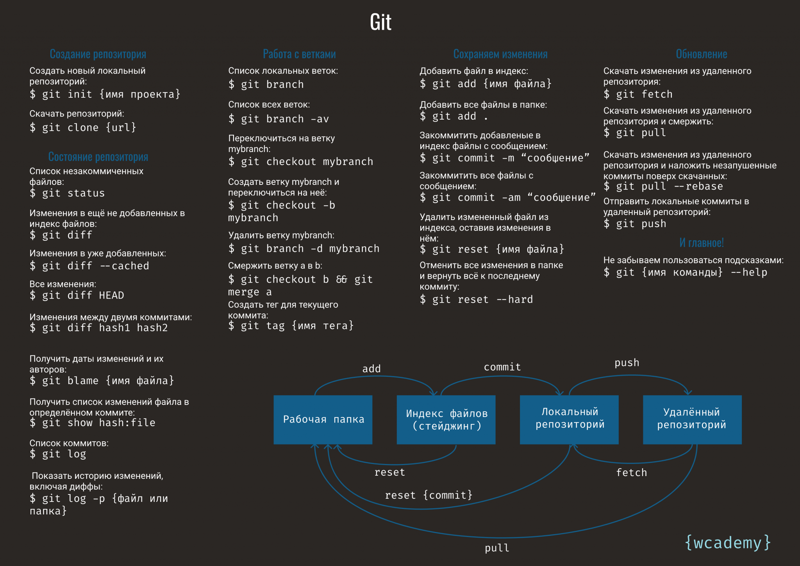

# Инструкция для работы с Markdown
<<<<<<< HEAD
Соддержание:
* Выделение текста
* Списки
* Работа с изображениями
* Ссылки
* Работа с таблицей шпаргалок Git
* Цытаты
* Заключение
=======
***Markdown*** - это облегчённый язык разметки, который преобразует текст в структурированный HTML. Следующее руководство поможет вам разобраться, как использовать *Markdown*.

>>>>>>> dev

## 1. Выделение текста
 Что выделить текст курсивом, необходимо обрамить его звёздочками (*) или знаком нижнего подчёркивания (_). 
 * Например, *Вот такк*

 * или _Вот так_

 Чтобы выделить текст полужирным, необходимо обрамить его двойными звёздочками (**) Или Двойным знаком нижнего подчёркивания (__).
 * Например, **Вот так**

 * или __Вот так__

Альтернативные способы выделения текста жырным или курсивом нужны для того, чтобы мы могли совмещать оба этих способа. 

* Например, _Текст может быть выделен курсивом и при этом быть **полужирным**_.

## 2. Списки

Чтобы добавить ненумерованные списки, необходимо пункты выделить (*) или знаком (+)

Например, вот так:

* Элемент 1

* Элемент 2

* Элемент 3

+ Элемент 4

Чтобы добавить нумерованные списки, необходимо пукты просто пронумеровать.
Например, вот так:

1. Элемент пункта

2. Элемент пункта

3. Элемент пункта

<<<<<<< HEAD
## 3. Работа с изображениями
=======
Вложенные списки
Также можно делать вложенные списки, добавляя 4 пробела перед пунктом: 
* Например: 
1. Список 1
    - подсписок 1
    - подсписок 2

# Работа с изображениями
>>>>>>> dev

Чтобы вствавить изображение в текс, достаточно сделать следующее:
 

Чтобы выделить не нумерованный список используйте (*)

## 4. Ссылки
Ссылки при использовании в **"MarkDown"** Достаточно просто вставить по ходу написания текста в удобное для Вас место. ***ВОЖНО*** проверять актуальность ссылок в источнике. По скольку некоторые источники могут удаляться лучше иметь нексколько источников для размещения одной и тоже ссылки.

Для лучшего запоминания команд в **_Git_** можно использовать шпаргалки в виде сохранённых ссылок.
* Например, вот так: https://www.neo-techno.ru/wp-content/uploads/2021/12/GIT_шпаргалка-2048x1448.png

<<<<<<< HEAD
## 5. Работа с таблицей шпаргалок **_Git_**
=======
Для быстрой работы лучше всего несколько раз потренитроваться в Visual Studio Code **_(VS Code)_**. Это поможет быстрее освоить навыки владения программой VS Code, а также ускорит запоминание команд и Вы сможете ошлифовать свои умения, полученные в результате обучения.
Так же Вам будет легче работать в **_Markdown_**, если вы создадите статью по его использованию совместно с ипользованием **_Git_** и добавите в неё шпаргалки и таблицы команд.
* Например, вот так: 
Табличы в Markdown создаются при помощи знака (|)

* Например: 

|Заголовок 1| Заголовок 2|
|-----------|------------|
|Ячейка 1   |Ячейка 2    |
|Ячейка 3   |Ячейка 4    |

## Цитаты
*  >Через 20 лет вы будете больше разочарованы теми вещами, которые вы не делали, чем теми, которые вы сделали. Так отчальте от тихой пристани. Почувствуйте попутный ветер в вашем парусе. Двигайтесь вперед, действуйте, открывайте!

>>*Марк Твен*

* >Ваше время ограничено, не тратьте его, живя чужой жизнью

>>*Стив Джобс*

* >Наука — это организованные знания, мудрость — это организованная жизнь.

>>*Иммануил Кант*
>>>>>>> dev

## 6. Цытаты

## 7. Заключение 